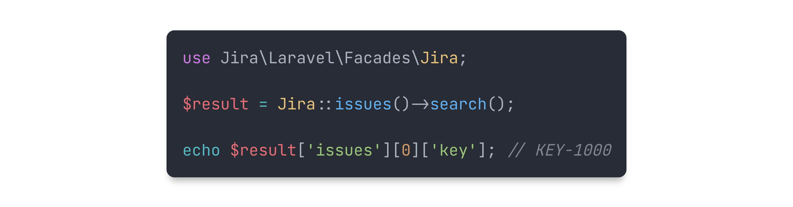

<p align="center">
    
</p>

<p align="center">
    <a href="https://github.com/devmoath/jira-laravel/actions"></a>
    <a href="https://packagist.org/packages/devmoath/jira-laravel"></a>
    <a href="https://packagist.org/packages/devmoath/jira-laravel"></a>
    <a href="https://packagist.org/packages/devmoath/jira-laravel"></a>
</p>

---

**Jira PHP** for Laravel is a supercharged PHP API client that allows you to interact with
the [Jira API](https://docs.atlassian.com/software/jira/docs/api/REST/8.0.0) and
the [Service Desk API](https://docs.atlassian.com/jira-servicedesk/REST/5.2.0/).

> **Note**
>
> This repository contains the integration code of the **Jira PHP** for Laravel. If you want to use the **Jira PHP**
> client in a framework-agnostic way, take a look at the [devmoath/jira-php](https://github.com/devmoath/jira-php)
> repository.

## Get Started

> **Requires [PHP 8.1+](https://php.net/releases/)**

First, install `devmoath/jira-laravel` via the [Composer](https://getcomposer.org/) package manager:

```bash
composer require devmoath/jira-laravel
```

Next, publish the configuration file:

```bash
php artisan vendor:publish --provider="Jira\Laravel\ServiceProvider"
```

This will create a `config/jira.php` configuration file in your project, which you can modify to your needs
using environment variables:

```dotenv
JIRA_USERNAME=USERNAME
JIRA_PASSWORD=PASSWORD
JIRA_HOST=jira.domain.com
```

Finally, you may use the `Jira` facade to access the available functions:

```php
use Jira\Laravel\Facades\Jira;

$result = Jira::issues()->search();

echo $result['issues'][0]['key']; // KEY-1000
```

## Usage

For usage examples, take a look at the [devmoath/jira-php](https://github.com/devmoath/jira-php) repository.

---

Jira PHP for Laravel is an open-sourced software licensed under the **[MIT license](https://opensource.org/licenses/MIT)**.
